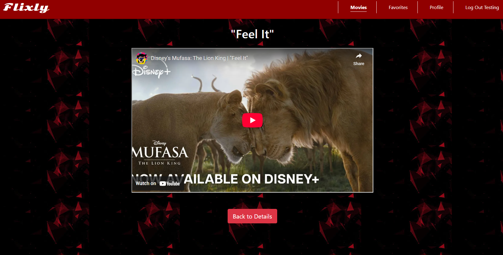

# Flixly - a Netflix inspired app

A full-page web application inspired by Netflix that allows users to view a list of popular movies, search for movies, rate and/or favorite movies, and watch the movie trailer. Built using JavaScript - Node - Express - React.

## Setup

### Local
#### /backend:

Node version and package.json install:
```
$ nvm use 22
```
```
$ npm install
```

Set up the database:  

 ```
$ psql < flixly.sql 
```  

Start server (localhost:3001)
```
$ npm start
```

#### /frontend:

Node version and package.json install:
```
$ nvm use 12
```
```
$ npm install
```

Start server (localhost:3000)
```
$ npm start
```

### Render
Click the link for Render live server app:  

[Flixly](https://foodtrucklocator.onrender.com)

## App Features:

All app features are intended to create an easy-to-use app for movie lovers. After the user-flow, see future updates planned for Flixly.

### Navigation Bar:  

*   Click **Flixly** to go to generic homepage. If logged out, you will see **Sign up** and **Login** buttons.
*   Click **Login** to go to login form. Click **Sing Up** to go to signup form.
*   Click **Movies** to view a list of popular movies. Each movie has a poster with limited details about the movie.
*   Click **Favorites** to view a list of your favorited movies. Each movie has a poster with limited details about the movie.
*   Click **Profile** to view/edit your account details. Username cannot be changed.  
*   Click **Log Out** to log out of your account.


### Movies Tab:

*   View a list of popular movies. Each movie has a poster with limited details about the movie.
*   **Movies** has search capabilities - enter a title to view a list of movies based on the search term(s). Each movie has a poster with limited details about the movie.
*   Click on a movie to view the movie details page. You have the following options:  
    *   Favorite or Un-favorite the movie.
    *   Rate the movie (0 - 5). If you have already rate the movie, you can edit or delete the rating.
    *   Play movie by clicking on the poster or **Play Movie** button. You will be directed to a viewing screen where you can make the video fullscreen.




### Favorites Tab:

*   View a list of your favorited movies. Each movie has a poster with limited details about the movie. NOTE: No search functionality.
*   Click on a movie to view the movie details page with the same options listed in the **Movies** tab.


### Profile Tab:

*   View you account details with the options to change: first name, last name, email, profile image, and password. *NOTE: cannot change username.


## APIs Used:

*   TMDB API

## Technology Used:

*   JavaScript
*   Node
*   Express
*   React
*   Bootstrap
*   FontAwesome

## Limitations

*   The app has not been styled for smaller screens yet.
*   The app is designed for the Quad City area only with capablity to expand due to interactive map

## Future Goals:

*   Classify trucks by category, enabling category search queries.
*   Search by currently open or rating.
*   Create a Schedule for User (Business) so the user can update location and hours of operation on a weekly basis rather than daily.